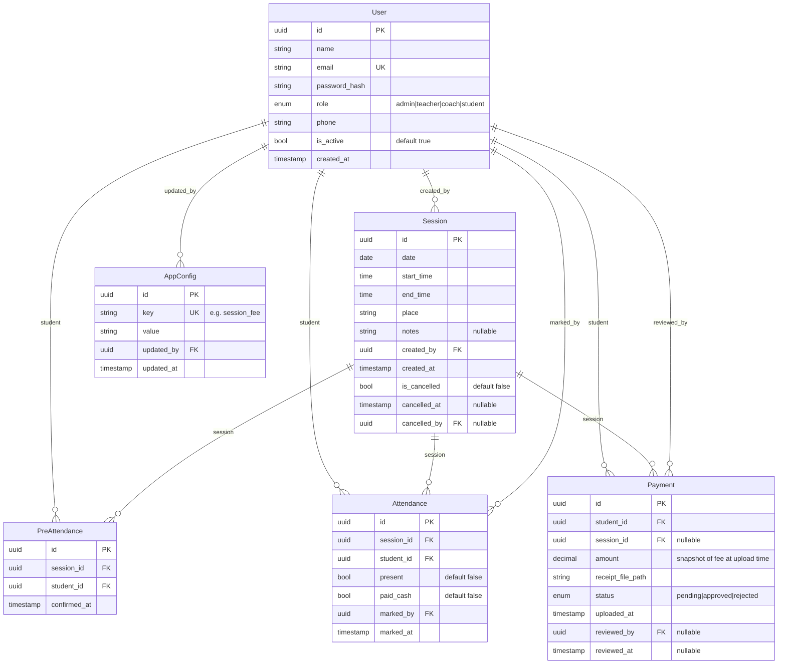

# Data Model

## Entity Relationship Diagram

## Table Notes

### User
- `email` is unique and used as login identifier.
- `is_active = false` is a soft delete — record is retained for historical FK references.
- `role` is an enum: `admin`, `teacher`, `coach`, `student`.

### Session
- `created_by` references `User.id` (teacher or admin who created the session).
- `notes` is optional free text.
- Cancellation is a **soft delete**: `is_cancelled` is set to `true` via `PATCH /api/sessions/:id`; the row is never deleted. `cancelled_at` and `cancelled_by` are set at the same time. This preserves historical attendance and payment records that reference the session.

### PreAttendance
- Unique constraint on `(session_id, student_id)` — one record per student per session.
- A student may toggle pre-attendance; the record is upserted (delete or update `confirmed_at`).
- Cutoff: students cannot change pre-attendance within 10 minutes of `session.start_time` (enforced in service layer).

### Attendance
- Unique constraint on `(session_id, student_id)`.
- `present` and `paid_cash` are independent boolean flags set by teacher.
- `marked_by` references the teacher who last updated the record.

### Payment
- `amount` captures the session fee **at the time of upload** — it is not recalculated if `AppConfig.session_fee` changes later.
- `session_id` is nullable: a payment may be submitted without being tied to a specific session.
- `status` flow: `pending` → `approved` or `rejected` (no revert).
- `reviewed_by` / `reviewed_at` set when admin or teacher acts on the payment.
- Receipt file stored on disk with UUID filename; `receipt_file_path` is the relative path under `/uploads`.

### AppConfig
- Keyed by string (e.g., `session_fee`).
- `value` stored as string; application parses to the appropriate type.
- `updated_by` references the admin who last changed the value.

## Indexes

| Table          | Index / Constraint                          |
|----------------|---------------------------------------------|
| `users`        | `UNIQUE (email)`                            |
| `sessions`     | `INDEX (date)`                              |
| `pre_attendance` | `UNIQUE (session_id, student_id)`         |
| `attendance`   | `UNIQUE (session_id, student_id)`           |
| `payments`     | `INDEX (student_id)`, `INDEX (status)`      |
| `app_config`   | `UNIQUE (key)`                              |
