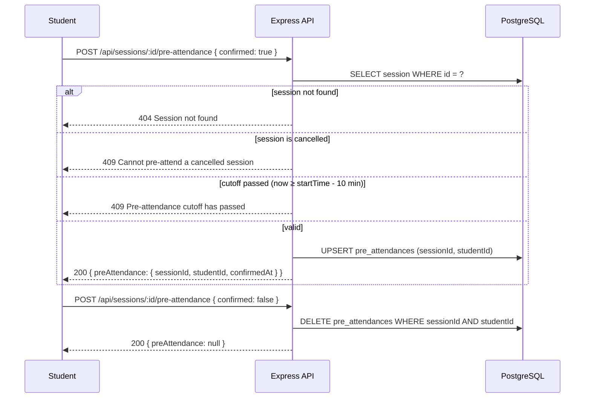
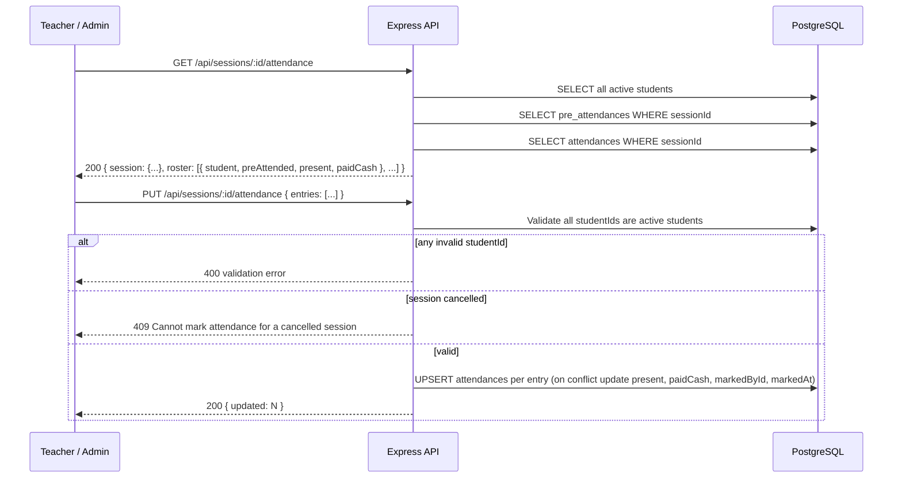

# Attendance Flow

## Two Distinct Concepts

| Concept | Table | Set by | Meaning |
|---------|-------|--------|---------|
| **PreAttendance** | `pre_attendances` | Student | Intent — "I plan to attend" |
| **Attendance** | `attendances` | Teacher / Admin | Reality — "This student actually attended / paid" |

These are independent records. A student can pre-attend and not show up (Attendance.present = false), or be marked present without having pre-attended.

## Roles × Actions

| Action | Admin | Teacher | Coach | Student |
|--------|:-----:|:-------:|:-----:|:-------:|
| Toggle pre-attendance | | | | ✓ |
| View attendance roster | ✓ | ✓ | | |
| Bulk mark attendance + cash | ✓ | ✓ | | |

## Pre-Attendance Flow

### Pre-Attendance Rules

- **Who:** Students only (403 for all other roles).
- **Cutoff:** Toggle is locked **10 minutes before** `session.startTime` (FR-21). After the cutoff, both setting and removing pre-attendance return 409.
- **Cancelled sessions:** 409 regardless of cutoff.
- **Toggle pattern:** `confirmed: true` upserts; `confirmed: false` deletes (hard delete — no soft delete on pre-attendance).
- **Idempotent:** Setting `confirmed: true` when a record already exists is safe (upsert). Setting `confirmed: false` when no record exists is also safe (no-op, returns `preAttendance: null`).

## Attendance Marking Flow

### Attendance Marking Rules

- **Who:** Admin and teacher (403 for coach/student).
- **Roster (`GET`):** Returns **all active students** (`role='student', isActive=true`) ordered by `name asc`, regardless of whether they have an Attendance row. `present` and `paidCash` default to `false` when no row exists.
- **Bulk PUT:** Sends the full or partial list of entries. All entries are upserted atomically.
  - `entries` must not be empty (400). Every `studentId` must be a valid active student — if any are invalid, the **entire batch** is rejected with `400: "Invalid or inactive student IDs: <id>, ..."` listing the offending IDs.
  - Upsert key: `(sessionId, studentId)`. On conflict, updates `present`, `paidCash`, `markedById = req.user.id`, `markedAt = now()`.
- **Cancelled sessions:** 409 — attendance cannot be marked for cancelled sessions.
- **Idempotent:** Calling PUT multiple times corrects mistakes. No history is kept — each call overwrites the current values.

## Pre-Attendance vs Attendance: Key Invariants

- A PreAttendance record means a student *intended* to attend — it does not create an Attendance record.
- An Attendance record is only created/updated via `PUT /sessions/:id/attendance` by a teacher or admin.
- Both tables use a unique constraint on `(sessionId, studentId)` — one record per student per session in each table.
- Deleting pre-attendance is a hard delete (no `deletedAt` column).
- `Attendance.markedAt` is always the timestamp of the last PUT that touched that row.

## API Reference

See `docs/api/openapi.yaml` paths:
- `POST /sessions/{id}/pre-attendance`
- `GET /sessions/{id}/attendance`
- `PUT /sessions/{id}/attendance`
