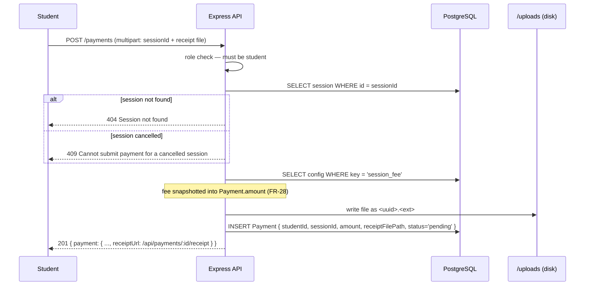
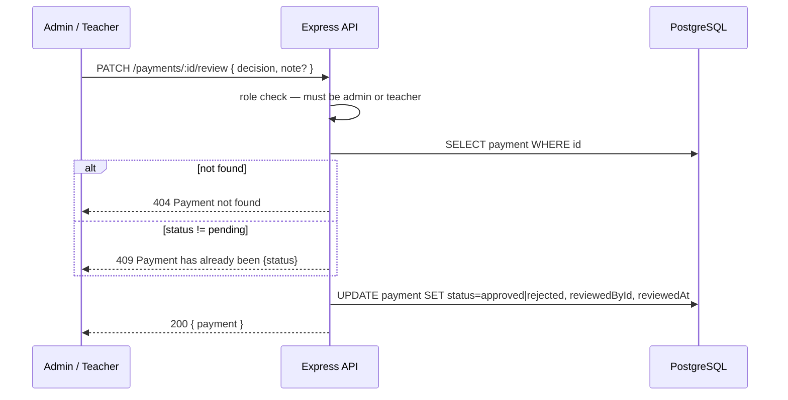

# Payment Flow

## End-to-End Overview

```
Admin sets session fee (PUT /config/fee)
        │
        ▼
Student uploads receipt for a session (POST /payments)
  → Fee is snapshotted into Payment.amount at this moment (FR-28)
  → Payment.status = pending
        │
        ▼
Admin / Teacher reviews the payment (PATCH /payments/:id/review)
  → decision: approve → Payment.status = approved
  → decision: reject  → Payment.status = rejected
```

Only `pending` payments can be reviewed. Once approved or rejected, the payment is terminal — there is no undo.

## Fee Configuration

| Endpoint | Role | Description |
|----------|:----:|-------------|
| `GET /config/fee` | Any authenticated | Returns current fee as `{ fee: number }` |
| `PUT /config/fee` | Admin only | Updates fee; returns `{ fee: number }` |

Fee is stored in `AppConfig` table under `key = 'session_fee'` as a string (e.g. `"50.00"`). The `GET` endpoint parses it to a JS number via `parseFloat`. Fee must be positive, ≤ 10 000, and have at most 2 decimal places.

**Fee snapshot rule (FR-28):** `Payment.amount` is set once at upload time by reading the current fee. Changing the fee later does **not** recalculate existing payment amounts.

## Role Matrix

| Action | Admin | Teacher | Student | Coach |
|--------|:-----:|:-------:|:-------:|:-----:|
| Get fee | ✓ | ✓ | ✓ | ✓ |
| Set fee | ✓ | | | |
| Upload receipt | | | ✓ | |
| List own payments | | | ✓ | |
| List all payments (filtered) | ✓ | ✓ | | |
| View any payment | ✓ | ✓ | own only | |
| Download any receipt | ✓ | ✓ | own only | |
| Approve / reject payment | ✓ | ✓ | | |

## Sequence: Student Uploads Receipt



## Sequence: Admin Reviews Payment



## Payment Status State Machine

```
                  ┌──────────┐
   upload         │          │   approve
──────────────►  pending  ──────────────► approved (terminal)
                  │          │
                  │          │   reject
                  └──────────┴──────────► rejected (terminal)
```

- Only `pending` payments can be reviewed. Reviewing an `approved` or `rejected` payment returns `409`.
- There is no re-open, refund, or undo operation in Phase 1.

## File Storage

| Property | Value |
|----------|-------|
| Storage location | `<project-root>/uploads/` (server-local disk) |
| Filename format | `<uuid>.<ext>` — original filename is discarded |
| Allowed MIME types | `image/jpeg`, `image/png`, `application/pdf` |
| Maximum file size | 5 MB |
| Web exposure | Not web-accessible directly — served via `GET /payments/:id/receipt` |
| Auth on download | Same role rules as payment read; student may only download own receipts |

Files are never deleted — `Payment` rows are never hard-deleted, so the receipt file remains on disk for the lifetime of the record.

## `receiptFilePath` vs `receiptUrl`

`receiptFilePath` is the internal server-side filename (stored in the DB). It is **never included in API responses**. Instead, `withReceiptUrl()` in the service layer appends `receiptUrl = /api/payments/{id}/receipt` to every payment object returned from the API.

## Error Reference

| Status | Endpoint | Message |
|--------|----------|---------|
| 400 | POST /payments | `"Invalid file type. Allowed: JPEG, PNG, PDF"` |
| 400 | POST /payments | `"File exceeds 5 MB limit"` |
| 400 | POST /payments | `"Receipt file is required"` |
| 400 | PUT /config/fee | Zod validation (not positive, >10000, >2 decimal places) |
| 403 | POST /payments | `"Forbidden"` (not student) |
| 403 | PATCH /payments/:id/review | `"Forbidden"` (not admin/teacher) |
| 404 | GET /config/fee | `"Session fee not configured"` |
| 404 | POST /payments | `"Session not found"` |
| 404 | GET /payments/:id/receipt | `"Payment not found"` / `"Receipt file not available"` / `"Receipt file not found on disk"` |
| 409 | POST /payments | `"Cannot submit payment for a cancelled session"` |
| 409 | PATCH /payments/:id/review | `"Payment has already been approved"` / `"Payment has already been rejected"` |

## Payment Object Shape

All payment responses include embedded relations regardless of caller role:

```json
{
  "id": "<uuid>",
  "studentId": "<uuid>",
  "sessionId": "<uuid>|null",
  "amount": "50.00",
  "receiptUrl": "/api/payments/<id>/receipt",
  "status": "pending|approved|rejected",
  "uploadedAt": "<ISO 8601>",
  "reviewedById": "<uuid>|null",
  "reviewedAt": "<ISO 8601>|null",
  "student": { "id": "<uuid>", "name": "...", "username": "..." },
  "session": { "id": "<uuid>", "date": "<ISO>", "startTime": "<ISO>", "place": "...", "isCancelled": false } | null,
  "reviewedBy": { "id": "<uuid>", "name": "..." } | null
}
```

`amount` is a Prisma `Decimal` serialized as a string. `receiptFilePath` is never included in API responses.

## API Reference

See `docs/api/openapi.yaml` paths:
- `GET /config/fee`
- `PUT /config/fee`
- `POST /payments`
- `GET /payments`
- `GET /payments/{id}`
- `GET /payments/{id}/receipt`
- `PATCH /payments/{id}/review`
