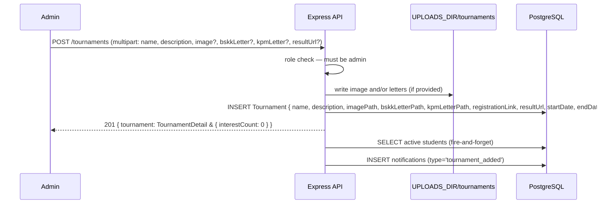

# Tournaments

## Feature Summary

Tournaments are informational posts created by admins. Students can express interest (one record per student per tournament). No registration or payment is handled in-app — the `registrationLink` field links out to an external form.

| Role | Capabilities |
|------|-------------|
| Admin | Create, update, delete tournaments; view interest counts |
| Teacher | View tournaments and interest counts |
| Coach | View tournaments and interest counts |
| Student | View tournaments; toggle own interest (`interested: true/false`) |

## Data Model

```
Tournament {
  id               uuid (PK)
  name             varchar(200)
  description      text
  place            string?           -- venue / location
  imagePath        string?           -- relative path under UPLOADS_DIR
  bskkLetterPath   string?           -- relative path to BSKK approval letter PDF
  kpmLetterPath    string?           -- relative path to KPM approval letter PDF
  registrationLink string?           -- external registration URL
  resultUrl        string?           -- URL to tournament results
  startDate        DateTime?
  endDate          DateTime?
  createdById      uuid (FK → User, RESTRICT)
  createdAt        DateTime
  updatedAt        DateTime
}

TournamentInterest {
  id           uuid (PK)
  tournamentId uuid (FK → Tournament, CASCADE DELETE)
  studentId    uuid (FK → User, CASCADE DELETE)
  confirmedAt  DateTime

  @@unique([tournamentId, studentId])
}

Indexes on Tournament: [startDate]
```

`Tournament` rows are hard-deleted (no soft delete). Deleting a tournament also deletes all `TournamentInterest` rows (CASCADE) and the image file from disk.

## File Attachments

All files are stored under `UPLOADS_DIR/tournaments/`. Internal paths (`imagePath`, `bskkLetterPath`, `kpmLetterPath`) are **never** exposed in API responses — boolean flags (`hasImage`, `hasBskkLetter`, `hasKpmLetter`) indicate presence.

### Tournament Image

| Property | Value |
|----------|-------|
| Subdirectory | `UPLOADS_DIR/tournaments/` |
| Allowed MIME types | `image/jpeg`, `image/png`, `image/webp` |
| Maximum size | 5 MB |
| Served via | `GET /api/tournaments/{id}/image` |
| On update | Old file deleted from disk before new one is saved |
| On delete | File deleted from disk |

To clear without replacement: send `removeImage=true` (string `"true"`) in the PATCH body.

### Approval Letters

Two optional PDF approval letters can be attached per tournament:

| Letter | Field | Served via |
|--------|-------|-----------|
| BSKK (Bahagian Sukan, Kesenian & Kokurikulum) | `bskkLetter` (form field) | `GET /api/tournaments/{id}/letter/bskk` |
| KPM (Kementerian Pendidikan Malaysia) | `kpmLetter` (form field) | `GET /api/tournaments/{id}/letter/kpm` |

| Property | Value |
|----------|-------|
| Allowed MIME types | `application/pdf` |
| Maximum size | 5 MB |
| `Content-Disposition` | `inline; filename="<stored-filename>"` |

To clear a letter without replacement: send `removeBskkLetter=true` or `removeKpmLetter=true` (string `"true"`) in the PATCH body.

Deleting a tournament removes all three files (image, BSKK letter, KPM letter) from disk.

### Result URL

`resultUrl` is an optional external URL pointing to the tournament results page. Sent as a plain string field in the multipart form body. Send an empty string to clear it.

## Notification Trigger

| Event | Audience | Type |
|-------|----------|------|
| Tournament created (`POST /tournaments`) | All active students | `tournament_added` |

Emission is fire-and-forget — failure does not affect tournament creation.

## Sequence: Admin Creates Tournament



## Interest Toggle Behaviour

```
Student calls POST /tournaments/:id/interest { interested: true }
  → upsert TournamentInterest (tournamentId, studentId)
  → return { interested: true, interestCount: N }

Student calls POST /tournaments/:id/interest { interested: false }
  → deleteMany TournamentInterest WHERE tournamentId AND studentId
  → return { interested: false, interestCount: N }
```

Idempotent in both directions. No notification is emitted on interest toggle.

**Response shape:** flat `{ interested, interestCount }` — no outer wrapper key (unlike most other endpoints).

## API Reference

See `docs/api/openapi.yaml` paths:
- `GET /tournaments`
- `POST /tournaments`
- `GET /tournaments/{id}`
- `PATCH /tournaments/{id}`
- `DELETE /tournaments/{id}`
- `GET /tournaments/{id}/image`
- `GET /tournaments/{id}/letter/{which}` — `which` ∈ `{bskk, kpm}`
- `POST /tournaments/{id}/interest`
