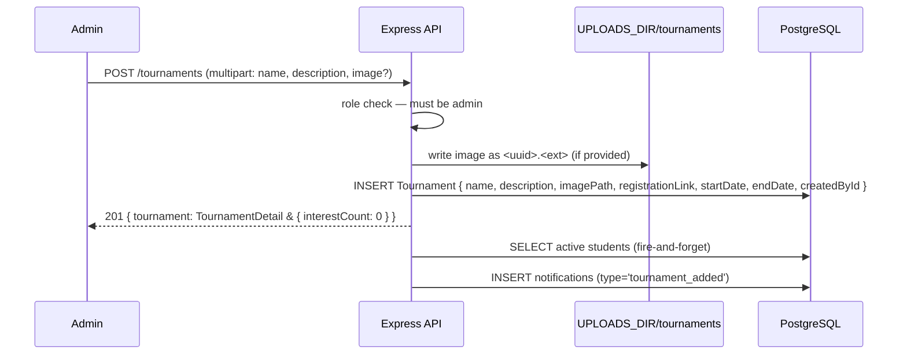

# Tournaments

## Feature Summary

Tournaments are informational posts created by admins. Students can express interest (one record per student per tournament). No registration or payment is handled in-app — the `registrationLink` field links out to an external form.

| Role | Capabilities |
|------|-------------|
| Admin | Create, update, delete tournaments; view interest counts |
| Teacher | View tournaments and interest counts |
| Coach | View tournaments and interest counts |
| Student | View tournaments; toggle own interest (`interested: true/false`) |

## Data Model

```
Tournament {
  id               uuid (PK)
  name             varchar(200)
  description      text
  place            string?       -- venue / location
  imagePath        string?       -- relative path under UPLOADS_DIR (e.g. "tournaments/uuid.jpg")
  registrationLink string?       -- external URL
  startDate        DateTime?
  endDate          DateTime?
  createdById      uuid (FK → User, RESTRICT)
  createdAt        DateTime
  updatedAt        DateTime
}

TournamentInterest {
  id           uuid (PK)
  tournamentId uuid (FK → Tournament, CASCADE DELETE)
  studentId    uuid (FK → User, CASCADE DELETE)
  confirmedAt  DateTime

  @@unique([tournamentId, studentId])
}

Indexes on Tournament: [startDate]
```

`Tournament` rows are hard-deleted (no soft delete). Deleting a tournament also deletes all `TournamentInterest` rows (CASCADE) and the image file from disk.

## Image Storage

| Property | Value |
|----------|-------|
| Subdirectory | `UPLOADS_DIR/tournaments/` |
| Filename format | `<uuid>.<ext>` — original filename discarded |
| Allowed MIME types | `image/jpeg`, `image/png`, `image/webp` |
| Maximum size | 5 MB |
| Served via | `GET /api/tournaments/{id}/image` (any authenticated role) |
| On tournament update | Old image deleted from disk before new one is saved |
| On tournament delete | Image file deleted from disk |

`imagePath` in API responses is the internal relative path (e.g. `"tournaments/abc123.jpg"`). Clients must not construct file URLs from this — use the authenticated image endpoint instead.

To remove an image without replacement, send `removeImage=true` (the string `"true"`) in the PATCH body.

## Notification Trigger

| Event | Audience | Type |
|-------|----------|------|
| Tournament created (`POST /tournaments`) | All active students | `tournament_added` |

Emission is fire-and-forget — failure does not affect tournament creation.

## Sequence: Admin Creates Tournament



## Interest Toggle Behaviour

```
Student calls POST /tournaments/:id/interest { interested: true }
  → upsert TournamentInterest (tournamentId, studentId)
  → return { interested: true, interestCount: N }

Student calls POST /tournaments/:id/interest { interested: false }
  → deleteMany TournamentInterest WHERE tournamentId AND studentId
  → return { interested: false, interestCount: N }
```

Idempotent in both directions. No notification is emitted on interest toggle.

**Response shape:** flat `{ interested, interestCount }` — no outer wrapper key (unlike most other endpoints).

## API Reference

See `docs/api/openapi.yaml` paths:
- `GET /tournaments`
- `POST /tournaments`
- `GET /tournaments/{id}`
- `PATCH /tournaments/{id}`
- `DELETE /tournaments/{id}`
- `GET /tournaments/{id}/image`
- `POST /tournaments/{id}/interest`
