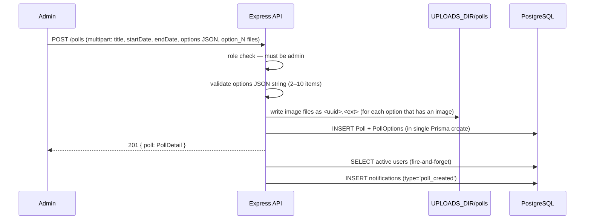

# Polls

## Feature Summary

Polls are time-bounded questions created by admins. Every authenticated user can vote exactly once per poll; results (vote counts and, for admin/teacher, the full voter list) are visible to everyone in real time.

| Role | Capabilities |
|------|-------------|
| Admin | Create, update, delete polls; view all vote counts and voter lists |
| Teacher | View polls and voter lists; vote |
| Coach | View polls and vote counts; vote |
| Student | View polls and vote counts; vote |

## Data Model

```
Poll {
  id           uuid (PK)
  title        varchar(200)
  description  text?
  startDate    DateTime
  endDate      DateTime
  createdById  uuid (FK → User, RESTRICT)
  createdAt    DateTime
  updatedAt    DateTime
}

PollOption {
  id        uuid (PK)
  pollId    uuid (FK → Poll, CASCADE DELETE)
  label     varchar(200)
  imagePath string?       -- internal path under UPLOADS_DIR; never exposed in API
  order     Int default 0 -- display order (0-indexed)

  @@unique([pollId, order])
}

Vote {
  id        uuid (PK)
  pollId    uuid (FK → Poll, CASCADE DELETE)
  optionId  uuid (FK → PollOption, CASCADE DELETE)
  userId    uuid (FK → User, CASCADE DELETE)
  createdAt DateTime

  @@unique([pollId, userId])    -- enforces one vote per user per poll
}

Indexes on Poll: (none beyond PK; list ordered by endDate desc at query time)
```

`Poll` rows are hard-deleted (no soft delete). Deleting a poll also deletes all `PollOption` and `Vote` rows (CASCADE) and all option image files from disk.

Options are created atomically with the poll. **Options cannot be edited after creation** — `PATCH /polls/{id}` only updates top-level poll fields.

## Poll State Machine

`isActive` is server-computed at response time from the current UTC clock; it is **not stored** in the database.

```
         now < startDate         startDate ≤ now ≤ endDate       now > endDate
┌─────────────────────┐     ┌──────────────────────────┐     ┌───────────────┐
│    not-started      │────▶│         active            │────▶│    expired    │
│  isActive = false   │     │   isActive = true         │     │ isActive=false│
│  voting blocked     │     │   voting allowed          │     │ voting blocked│
└─────────────────────┘     └──────────────────────────┘     └───────────────┘
```

Voting is gated by this state — the service throws 409 (`Poll has not started` / `Poll has ended`) if the poll is not active.

## Role-Gated Response Fields

`GET /polls/{id}` and `POST /polls/{id}/vote` (201) both return a `PollDetail` object. The `options` array inside it contains `PollOptionDetail` items whose shape varies by caller role:

| Field | Student / Coach | Admin / Teacher |
|-------|----------------|-----------------|
| `id` | ✓ | ✓ |
| `label` | ✓ | ✓ |
| `order` | ✓ | ✓ |
| `hasImage` | ✓ | ✓ |
| `voteCount` | ✓ | ✓ |
| `voters` | — (omitted) | ✓ — `[{ id, name, className }]` sorted by name asc |

`GET /polls` list is unaffected — it returns `PollSummary` objects which have no option data.

## Immutable Vote Rule

The `@@unique([pollId, userId])` constraint in Prisma maps to a database unique index. Attempting a second `Vote.create` for the same `(pollId, userId)` raises a Prisma `P2002` error, which the service translates to `409 You have already voted`. There is no vote-change or vote-retraction endpoint.

## Image Storage

| Property | Value |
|----------|-------|
| Subdirectory | `UPLOADS_DIR/polls/` |
| Filename format | `<uuid>.<ext>` — original filename discarded |
| Allowed MIME types | `image/jpeg`, `image/png`, `image/webp` |
| Maximum size | 5 MB per file |
| Served via | `GET /api/polls/{id}/options/{optionId}/image` (any authenticated role) |
| On poll delete | All option image files deleted from disk |

`imagePath` on `PollOption` is **never exposed** in API responses. The API surface exposes only `hasImage: boolean`. Clients must call the authenticated image endpoint to retrieve the file.

Option images are uploaded in the `POST /polls` multipart form using field names `option_0`, `option_1`, … `option_9` (one per option index). An image for a given option is optional; omitting the field leaves `imagePath` null.

## Notification Trigger

| Event | Audience | Type |
|-------|----------|------|
| Poll created (`POST /polls`) | All active users except creator | `poll_created` |

Emission is fire-and-forget — failure does not affect poll creation.

## Sequence: Admin Creates Poll



## API Reference

See `docs/api/openapi.yaml` paths:
- `GET /polls`
- `POST /polls`
- `GET /polls/{id}`
- `PATCH /polls/{id}`
- `DELETE /polls/{id}`
- `GET /polls/{id}/options/{optionId}/image`
- `POST /polls/{id}/vote`
